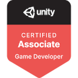

### Hi there 👋
---
- 🎓 I majored in `Business Administration` and `English Linguistics` at <b>HUFS</b>.
- I'm very interested in `Game Design`.

---
- 💻 I’m interested in `Game Design`, `Unity`, `C#`, `C++`.
- 😄 I got a Unity GameDev certification.

---
- 🌱 I’m currently learning in 42 Seoul.

---
- 😎 Everyday, I solve more than one PS at BOJ.
- 🤪 A hobby that gives me a sense of accomplishment.
- ⚡ Proof of consistent conscientiousness.

<!--
**soo-bak/soo-bak** is a ✨ _special_ ✨ repository because its `README.md` (this file) appears on your GitHub profile.

Here are some ideas to get you started:

- 🔭 I’m currently working on ...
- 🌱 I’m currently learning ...
- 👯 I’m looking to collaborate on ...
- 🤔 I’m looking for help with ...
- 💬 Ask me about ...
- 📫 How to reach me: ...
- 😄 Pronouns: ...
- ⚡ Fun fact: ... 🤪
-->
